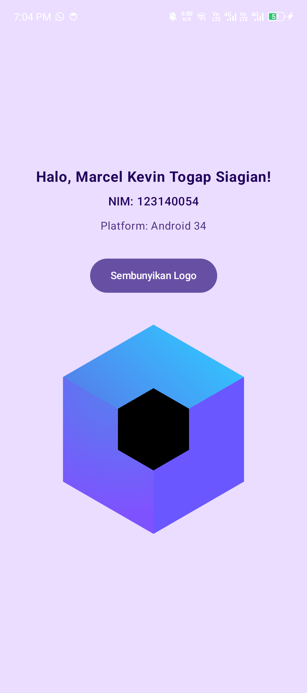
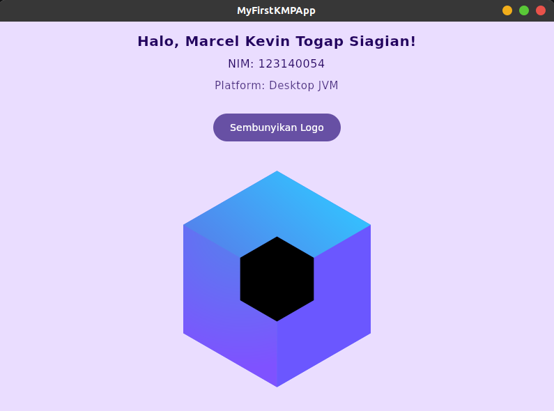

# Tugas Praktikum 1: Pengenalan Kotlin Multiplatform & Setup Environment

Mata Kuliah: **Pengembangan Aplikasi Mobile (IF25-22017)**  
Program Studi Teknik Informatika — Institut Teknologi Sumatera

---

## 👤 Identitas Mahasiswa
* **Nama:** Marcel Kevin Togap Siagian
* **NIM:** 123140054
* **Kelas:** Pengembangan Aplikasi Mobile

---

## 📱 Deskripsi Aplikasi
Aplikasi ini dibangun menggunakan **Kotlin Multiplatform (KMP)** dan **Compose Multiplatform**. Aplikasi menampilkan salam dengan identitas mahasiswa (Nama dan NIM) serta mendeteksi platform target yang sedang berjalan secara dinamis menggunakan mekanisme Kotlin Multiplatform (`expect` / `actual`).

Aplikasi mendukung multiplatform:
1. **Android** (Dijalankan di perangkat fisik smartphone)
2. **Desktop** (JVM / Linux Desktop)
3. **iOS** *(Opsional)*

---

## 📸 Tangkapan Layar (Screenshots)

### 1. Tampilan pada Android (HP Fisik)


### 2. Tampilan pada Desktop (Linux JVM)


---

## 🚀 Cara Menjalankan Proyek

### 1. Menjalankan di Android
* **Melalui Android Studio:**
  1. Buka proyek ini di Android Studio.
  2. Pilih konfigurasi **`androidApp`**.
  3. Hubungkan perangkat fisik Android (aktifkan USB Debugging) atau gunakan Emulator.
  4. Klik tombol **Run ▶️**.
* **Melalui Terminal:**
  ```bash
  ./gradlew :androidApp:installDebug
  ```

### 2. Menjalankan di Desktop (Linux)
Jalankan perintah berikut di terminal:
```bash
./gradlew :desktopApp:run
```

---

## 🛠️ Tech Stack & Dependencies
* **Bahasa:** Kotlin 2.x
* **UI Toolkit:** Compose Multiplatform
* **Build Tool:** Gradle (Kotlin DSL)
* **Target:** Android & Desktop (JVM)