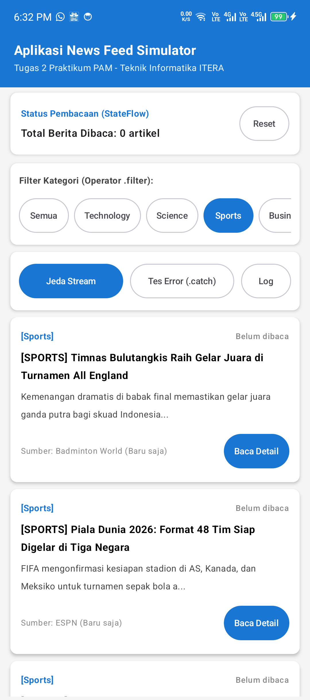
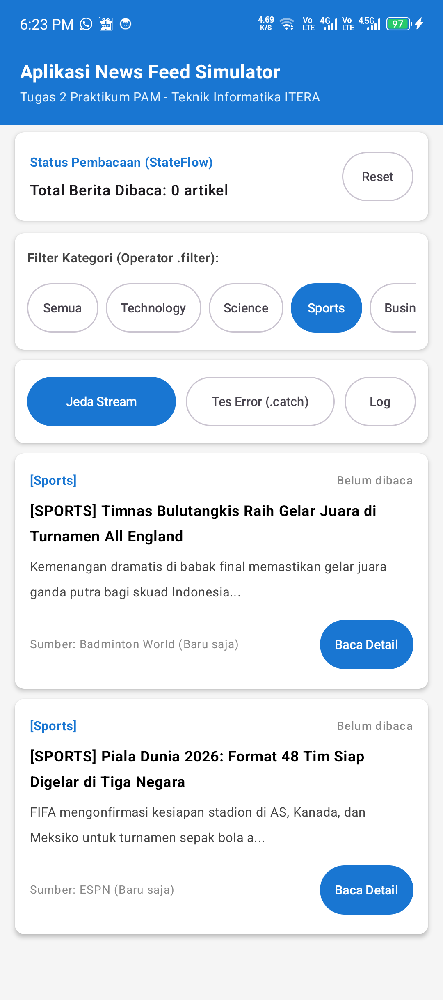
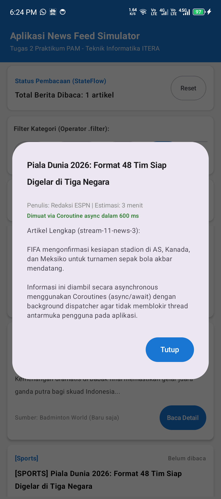
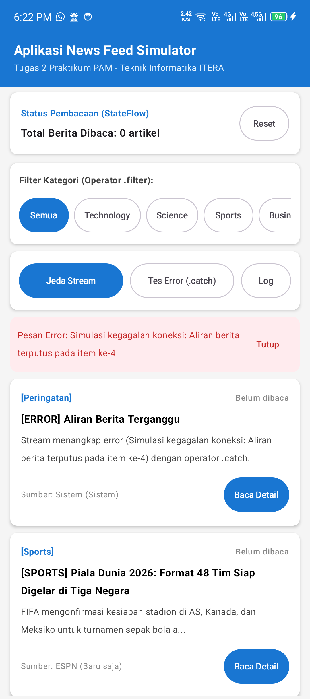
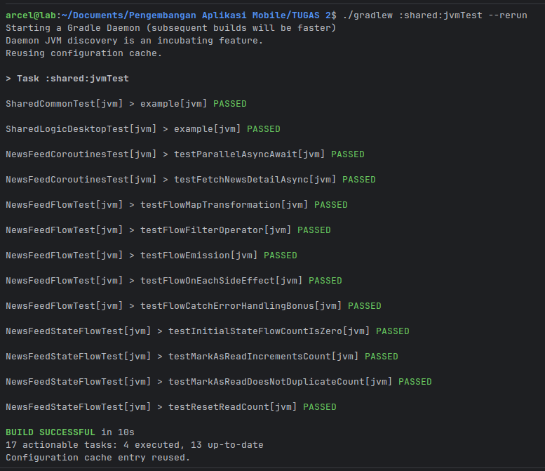

# News Feed Simulator - Tugas Praktikum 2

**Mata Kuliah:** Pengembangan Aplikasi Mobile (IF25-22017)  
**Program Studi:** Teknik Informatika - Institut Teknologi Sumatera (ITERA)  
**Materi:** Pertemuan 2 - *Advanced Kotlin, Coroutines, dan Flow*  
**Platform:** Kotlin Multiplatform (KMP) & Compose Multiplatform  

---

## 📌 Deskripsi Tugas

Aplikasi **News Feed Simulator** adalah aplikasi simulasi aliran berita real-time yang dibangun menggunakan **Kotlin Multiplatform (KMP)**. Aplikasi ini mengimplementasikan konsep pemrograman asinkron modern di Kotlin, berfokus pada **Kotlin Coroutines** untuk operasi asynchronous non-blocking dan **Kotlin Flow** sebagai reactive stream untuk pengiriman data berkala.

---

## 🚀 Pemetaan Kebutuhan Tugas & Rubrik Penilaian

| No | Kebutuhan Fitur | Konsep & Operator | Lokasi Implementasi | Status |
| :---: | :--- | :--- | :--- | :---: |
| **1** | **Flow Simulasi Berita (2s)** | `flow { ... }`, `delay(2000L)`, `emit()` | [`NewsRepository.kt`](./shared/src/commonMain/kotlin/com/example/myfirstkmpapp/newsfeed/NewsRepository.kt) | ✅ Selesai |
| **2** | **Filter Kategori Berita** | Operator `.filter { ... }` | [`NewsFeedManager.kt`](./shared/src/commonMain/kotlin/com/example/myfirstkmpapp/newsfeed/NewsFeedManager.kt) | ✅ Selesai |
| **3** | **Transformasi Tampilan** | Operator `.map { ... }` & Extension Functions | [`NewsModels.kt`](./shared/src/commonMain/kotlin/com/example/myfirstkmpapp/newsfeed/NewsModels.kt) & [`NewsFeedManager.kt`](./shared/src/commonMain/kotlin/com/example/myfirstkmpapp/newsfeed/NewsFeedManager.kt) | ✅ Selesai |
| **4** | **StateFlow Berita Dibaca** | `MutableStateFlow` privat & `StateFlow` publik | [`NewsFeedManager.kt`](./shared/src/commonMain/kotlin/com/example/myfirstkmpapp/newsfeed/NewsFeedManager.kt) | ✅ Selesai |
| **5** | **Async Detail Berita** | Coroutines `async` / `await` & `Dispatchers` | [`NewsFeedManager.kt`](./shared/src/commonMain/kotlin/com/example/myfirstkmpapp/newsfeed/NewsFeedManager.kt) | ✅ Selesai |
| **⭐** | **Bonus 1: Unit Test** | `runTest` (`kotlinx-coroutines-test`) | [`commonTest/.../newsfeed/`](./shared/src/commonTest/kotlin/com/example/myfirstkmpapp/newsfeed/) | ✅ +10% |
| **⭐** | **Bonus 2: Error Handling** | Operator `.catch { ... }` & `try-catch` | [`NewsFeedManager.kt`](./shared/src/commonMain/kotlin/com/example/myfirstkmpapp/newsfeed/NewsFeedManager.kt) | ✅ +10% |

---

## 🏗️ Struktur Arsitektur Modul

```
shared/src/
├── commonMain/kotlin/com/example/myfirstkmpapp/
│   ├── newsfeed/
│   │   ├── NewsModels.kt             # Data Class, Model Tampilan, & Extension Functions
│   │   ├── NewsRepository.kt         # Cold Flow Producer (emit tiap 2s) & Async Fetcher
│   │   ├── NewsFeedManager.kt        # State Management (StateFlow) & Pipeline (.filter, .map, .onEach, .catch)
│   │   └── NewsFeedSimulatorRunner.kt# Runner Simulasi Konsol (CLI)
│   └── App.kt                        # UI Interaktif Compose Multiplatform
└── commonTest/kotlin/com/example/myfirstkmpapp/newsfeed/
    ├── NewsFeedFlowTest.kt           # Pengujian Flow emission, filter, map, onEach, dan .catch
    ├── NewsFeedCoroutinesTest.kt     # Pengujian Coroutines async/await & parallel fetching
    └── NewsFeedStateFlowTest.kt      # Pengujian StateFlow reactivity & idempotensi read counter
```

---

## 💡 Penjelasan Implementasi Teknis

### 1. Flow Simulasi Berita Baru (`emit` setiap 2 detik)
Pada `NewsRepository.kt`, fungsi `getNewsStream(intervalMs = 2000L)` memproduksi *cold stream* menggunakan Flow builder. Setiap 2 detik, sistem memancarkan objek `NewsItem` baru:
```kotlin
override fun getNewsStream(intervalMs: Long, simulateErrorAtCount: Int): Flow<NewsItem> = flow {
    var count = 0
    var index = 0
    while (true) {
        delay(intervalMs)
        count++
        if (simulateErrorAtCount > 0 && count >= simulateErrorAtCount) {
            throw IllegalStateException("Simulasi kegagalan koneksi: Aliran berita terputus pada item ke-$count")
        }
        val item = sampleNewsList[index % sampleNewsList.size].copy(
            id = "stream-$count-${itemOrFallbackId(index)}",
            timestamp = 1716000000000L + (count * 2000L)
        )
        emit(item)
        index++
    }
}
```

### 2. Rantai Operator Flow (`filter`, `onEach`, `map`, `.catch`)
Pada `NewsFeedManager.kt`, data yang dipancarkan diproses secara berantai melalui operator deklaratif:
```kotlin
fun createNewsFeedFlow(categoryFilter: String, intervalMs: Long = 2000L, simulateErrorAtCount: Int = -1): Flow<DisplayNewsItem> {
    return repository.getNewsStream(intervalMs, simulateErrorAtCount)
        .filter { item -> // Kebutuhan 2: Filter kategori
            if (categoryFilter.equals("ALL", ignoreCase = true)) true
            else item.category.equals(categoryFilter, ignoreCase = true)
        }
        .onEach { filteredItem -> // Operator side-effect & log
            addLog("Menerima berita [${filteredItem.category}]: ${filteredItem.title.take(30)}...")
        }
        .map { rawItem -> // Kebutuhan 3: Transformasi ke format tampilan
            rawItem.toDisplayFormat()
        }
        .catch { throwable -> // Komponen Bonus: Graceful error handling
            val errorMsg = throwable.message ?: "Kesalahan tidak terduga pada stream"
            _lastError.value = errorMsg
            emit(fallbackDisplayItem(errorMsg))
        }
}
```

### 3. State Management dengan StateFlow
Memenuhi prinsip enkapsulasi:
* `_readCount` bersifat `private val MutableStateFlow(0)`
* `readCount` diekspos secara aman ke publik sebagai read-only `val StateFlow<Int> = _readCount.asStateFlow()`
* Tracking `_readNewsIds` memastikan membaca artikel yang sama tidak menghitung ganda (*idempotent*).

### 4. Asynchronous Detail dengan Coroutines (`async` / `await`)
Ketika artikel ditekan untuk membaca detail, proses dilakukan di background thread (`Dispatchers.Default`) menggunakan coroutine builder `async`:
```kotlin
val deferredDetail = scope.async(Dispatchers.Default) {
    repository.fetchNewsDetail(newsId)
}
val detail = deferredDetail.await()
```

---

## 🧪 Pengujian Unit (Unit Test & Komponen Bonus)

Proyek ini dilengkapi **11 unit test terstruktur** yang mencakup pengujian Flow, Coroutines, StateFlow, dan Error Handling menggunakan pustaka `kotlinx-coroutines-test`:

1. `NewsFeedFlowTest`:
   * `testFlowEmission`: Memverifikasi emisi berkala stream Flow.
   * `testFlowFilterOperator`: Memverifikasi operator `.filter` menyaring kategori secara akurat.
   * `testFlowMapTransformation`: Memverifikasi operator `.map` dan extension function memformat judul dan badge.
   * `testFlowOnEachSideEffect`: Memverifikasi side effect logging terpanggil saat item lewat.
   * `testFlowCatchErrorHandlingBonus`: Memverifikasi operator `.catch` menangani exception tanpa menghentikan konsumen.
2. `NewsFeedCoroutinesTest`:
   * `testFetchNewsDetailAsync`: Memverifikasi pemanggilan detail async non-blocking dan penambahan counter baca.
   * `testParallelAsyncAwait`: Memverifikasi pengambilan paralel multi-detail menggunakan `async`/`await`.
3. `NewsFeedStateFlowTest`:
   * `testInitialStateFlowCountIsZero`: Memverifikasi nilai awal StateFlow adalah 0.
   * `testMarkAsReadIncrementsCount`: Memverifikasi reaktivitas penambahan nilai.
   * `testMarkAsReadDoesNotDuplicateCount`: Memverifikasi proteksi duplikasi ID.
   * `testResetReadCount`: Memverifikasi fitur reset counter kembali ke 0.

### 💻 Cara Menjalankan & Memeriksa Unit Test dari Terminal

Proyek telah dikonfigurasi dengan blok `testLogging` di `shared/build.gradle.kts` agar setiap nama pengujian dan status kelulusannya langsung tercetak jelas di terminal (*standard output*).

#### 1. Perintah Standar
Jalankan perintah berikut di root folder proyek:
```bash
./gradlew :shared:jvmTest
```

#### 2. Menjalankan Ulang (Force Re-run)
Jika tidak ada perubahan kode tetapi Anda ingin menjalankan ulang dan melihat kembali output setiap tes di layar terminal:
```bash
./gradlew :shared:jvmTest --rerun
```

#### 3. Tampilan Hasil yang Muncul di Terminal
Output akan menampilkan rincian method test yang lulus seperti di bawah ini:
```text
> Task :shared:jvmTest

NewsFeedCoroutinesTest[jvm] > testParallelAsyncAwait[jvm] PASSED
NewsFeedCoroutinesTest[jvm] > testFetchNewsDetailAsync[jvm] PASSED
NewsFeedFlowTest[jvm] > testFlowMapTransformation[jvm] PASSED
NewsFeedFlowTest[jvm] > testFlowFilterOperator[jvm] PASSED
NewsFeedFlowTest[jvm] > testFlowEmission[jvm] PASSED
NewsFeedFlowTest[jvm] > testFlowOnEachSideEffect[jvm] PASSED
NewsFeedFlowTest[jvm] > testFlowCatchErrorHandlingBonus[jvm] PASSED
NewsFeedStateFlowTest[jvm] > testInitialStateFlowCountIsZero[jvm] PASSED
NewsFeedStateFlowTest[jvm] > testMarkAsReadIncrementsCount[jvm] PASSED
NewsFeedStateFlowTest[jvm] > testMarkAsReadDoesNotDuplicateCount[jvm] PASSED
NewsFeedStateFlowTest[jvm] > testResetReadCount[jvm] PASSED

BUILD SUCCESSFUL
13 tests, 0 failures, 0 ignored, 100% successful
```

#### 4. Melihat Laporan Interaktif (HTML Report)
Selain output terminal, Gradle juga men-generate laporan HTML lengkap yang dapat dibuka melalui browser:
* Lokasi file: `shared/build/reports/tests/jvmTest/index.html`

---

## 🖥️ Cara Menjalankan Aplikasi

Pastikan JDK 17 atau 21 sudah terpasang.

### 1. Menjalankan Aplikasi Desktop
```bash
./gradlew :desktopApp:run
```

### 2. Mengompilasi Aplikasi Android
```bash
./gradlew :androidApp:assembleDebug
```
File APK debug akan dihasilkan di `androidApp/build/outputs/apk/debug/androidApp-debug.apk`.

### 3. Menjalankan Simulasi Berbasis Konsol (Opsional)
Anda juga dapat mengeksekusi `NewsFeedSimulatorRunner.runConsoleSimulation()` untuk melihat visualisasi alur streaming pada output konsol.

---

## 📸 Dokumentasi & Tangkapan Layar Aplikasi

| 1. Tampilan Awal & StateFlow | 2. Aliran Berita Real-Time (Flow 2s) |
| :---: | :---: |
|  |  |

| 3. Pengujian Filter Kategori (.filter) | 4. Detail Berita Async (async/await) |
| :---: | :---: |
|  |  |

| 5. Pengujian Error Handling (.catch) | 6. Verifikasi Unit Test (13 Tests Passed) |
| :---: | :---: |
|  |  |

---

## 👨‍💻 Kontributor

* **Nama:** Marcel Kevin Togap Siagian
* **NIM:** 123140054
* **Prodi:** Teknik Informatika