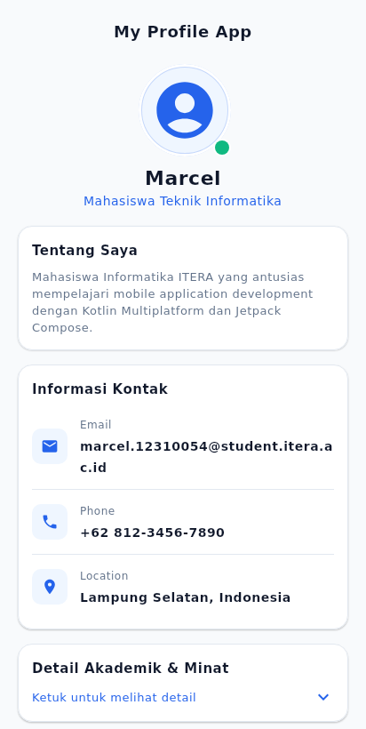
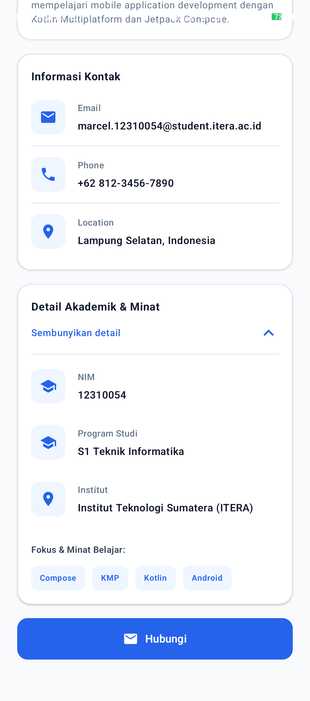
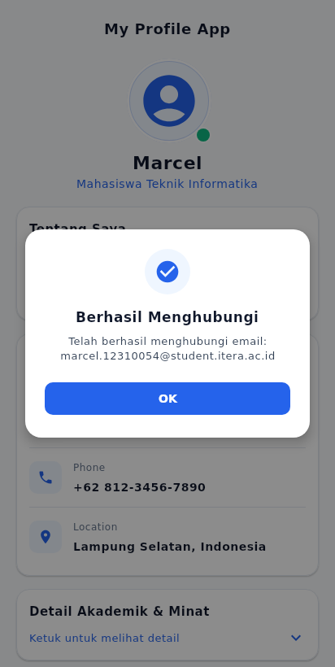

# My Profile App 📱

Tugas Praktikum Pertemuan 3 - **Compose Multiplatform Basics**  
Mata Kuliah: **Pengembangan Aplikasi Mobile (IF25-22017)**  
Program Studi: **Teknik Informatika - Institut Teknologi Sumatera (ITERA)**

---

## 📌 Deskripsi Tugas

Aplikasi **"My Profile App"** dibangun menggunakan **Kotlin Multiplatform (KMP)** dan **Compose Multiplatform**, menyajikan antarmuka profil modern, bersih (*clean & minimal*), responsif, serta multiplatform (Android, Desktop, dan iOS).

Aplikasi ini memenuhi seluruh kriteria dan spesifikasi dari **Pertemuan 3: Compose Multiplatform Basics (Layouts, UI Components, dan Modifiers)**, termasuk implementasi fitur bonus animasi.

---

## 🚀 Fitur dan Spesifikasi

### 1. Halaman Profil
- **Profile Header**: Menampilkan avatar kontak standar (`Icons.Default.AccountCircle` via `rememberVectorPainter`) dalam kontainer melingkar (`Modifier.clip(CircleShape)`) dengan outline border ganda dan active status indicator dot.
- **Identitas**: Nama **Marcel**, NIM **12310054**, dan Program Studi Teknik Informatika ITERA.
- **Bio Singkat**: Deskripsi ringkas perkenalan mahasiswa.
- **List Informasi Kontak**: Informasi terstruktur untuk **Email** (`marcel.12310054@student.itera.ac.id`), **Phone** (`+62 812-3456-7890`), dan **Location** (`Lampung Selatan, Indonesia`).
- **Action Button & Notifikasi**: Tombol utama *"Hubungi"* (single CTA, full-width) yang ketika diklik memunculkan pop-up dialog (`AlertDialog`) sekali di tengah layar: *"Telah berhasil menghubungi email: marcel.12310054@student.itera.ac.id"*.

### 2. Tiga Reusable Composable Functions
Sesuai ketentuan tugas (minimal 3 reusable composables):
1. **`ProfileHeader`**: Komponen modular penyusun header profil (avatar kontak, status badge, nama, role, bio).
2. **`InfoItem`**: Komponen modular baris informasi yang reusable (icon, label/kategori, nilai informasi).
3. **`ProfileCard`**: Container kartu berbasis `Card` dengan elevasi, sudut membulat (`RoundedCornerShape(16.dp)`), serta border halus untuk mengelompokkan konten secara rapi.

### 3. Penggunaan Komponen UI & Layout Wajib
- **Layout Dasar**:
  - `Column`: Menyusun elemen secara vertikal (root scrollable column, card inner layout, text stack).
  - `Row`: Menyusun elemen secara horizontal (`InfoItem`, skill chips).
  - `Box`: Menyusun elemen secara tumpuk/layer (foto profil dengan status indicator, icon container, skill chip).
- **Container**: `Card` (elevasi & rounded shape), `Surface`, dan `AlertDialog`.
- **Komponen UI**: `Text`, `Button`, `TextButton`, `Image`, dan `Icon` (`Icons.Default.*`).
- **Modifiers**: Chaining modifier yang terstruktur dengan urutan eksekusi yang tepat (`padding`, `background`, `clip`, `border`, `size`, `fillMaxWidth`, `clickable`).

### 4. 🌟 Fitur Bonus (+10%): Animasi `AnimatedVisibility`
- Dilengkapi dengan fitur interaktif untuk membuka/menutup **Detail Informasi Akademik & Minat Belajar**.
- Efek transisi halus:
  - **Enter**: `fadeIn() + expandVertically()`
  - **Exit**: `fadeOut() + shrinkVertically()`
- Menyajikan informasi NIM, Program Studi, Institusi, serta daftar tag keahlian (*Skill Chips*: Compose, KMP, Kotlin, Android).

---

## 🛠️ Struktur Komponen (`App.kt`)

```text
App
└── MaterialTheme (Custom Slate-Blue Clean Palette)
    └── Surface
        └── ProfileScreen (Column + verticalScroll)
            ├── Text ("My Profile App")
            ├── ProfileHeader (Avatar Kontak Circular + Status Badge + Nama + Role)
            ├── ProfileCard ("Tentang Saya")
            │   └── Text (Deskripsi Bio Mahasiswa)
            ├── ProfileCard ("Informasi Kontak")
            │   ├── InfoItem (Email: marcel.12310054@student.itera.ac.id)
            │   ├── HorizontalDivider
            │   ├── InfoItem (Phone)
            │   ├── HorizontalDivider
            │   └── InfoItem (Location)
            ├── ProfileCard ("Detail Akademik & Minat" - Interactive Toggle)
            │   └── AnimatedVisibility [BONUS]
            │       ├── InfoItem (NIM: 12310054)
            │       ├── InfoItem (Program Studi)
            │       ├── InfoItem (Institut)
            │       └── Row (SkillChips: Compose, KMP, Kotlin, Android)
            ├── Button ("Hubungi" - Full Width CTA)
            └── AlertDialog ("Berhasil Menghubungi" - Pop-up tunggal)
```

---

## 💻 Cara Menjalankan Aplikasi

Pastikan JDK 17+ telah terpasang di sistem Anda.

### 1. Menjalankan di Desktop (JVM)
```bash
./gradlew :desktopApp:run
```

### 2. Menjalankan / Build di Android
```bash
# Build APK Debug
./gradlew :androidApp:assembleDebug

# Jalankan langsung ke perangkat/emulator Android yang terhubung
./gradlew :androidApp:installDebug
```

### 3. Menjalankan di iOS
Buka folder `iosApp` di Xcode pada macOS:
```bash
open iosApp/iosApp.xcworkspace
```

---

## 📸 Screenshot Aplikasi

Berikut adalah hasil tangkapan layar antarmuka aplikasi **"My Profile App"** pada berbagai kondisi:

| 1. Tampilan Utama (Default) |                                      2. Detail Terbuka (Bonus Animasi)                                       | 3. Pop-up Dialog "Hubungi" |
| :---: |:------------------------------------------------------------------------------------------------------------:| :---: |
|  |  |  |

> **Keterangan Tangkapan Layar:**
> 1. **Tampilan Utama (Default)**: Memperlihatkan header profil ber-avatar melingkar (`CircleShape`), identitas nama Marcel, kartu *"Tentang Saya"*, kartu *"Informasi Kontak"* (Email, Phone, Location), dan kartu *"Detail Akademik"* (collapsed).
> 2. **Detail Terbuka (Fitur Bonus +10%)**: Memperlihatkan hasil interaksi **`AnimatedVisibility`** saat kartu detail diketuk, menyajikan NIM (`12310054`), Program Studi, Institut ITERA, dan chip keahlian.
> 3. **Pop-up Dialog "Hubungi"**: Memperlihatkan pop-up dialog modal tunggal berlatar gelap (*scrim*) saat tombol *"Hubungi"* ditekan.

---

## 📄 Rubrik & Kriteria Penilaian

- [x] **Layout Implementation (25%)**: Implementasi `Column`, `Row`, dan `Box` secara presisi dan terstruktur.
- [x] **Reusable Composables (25%)**: 3 custom composables (`ProfileHeader`, `InfoItem`, `ProfileCard`).
- [x] **UI Components (20%)**: Implementasi `Text`, `Button`, `Image`, `Card`, dan `Icon`.
- [x] **Modifiers (15%)**: Penerapan urutan chaining modifier secara disiplin dan clean.
- [x] **Code Quality (15%)**: Clean code, penamaan PascalCase untuk composable, modularitas tinggi, dan dokumentasi lengkap.
- [x] **🌟 Bonus (+10%)**: Implementasi animasi halus `AnimatedVisibility`.